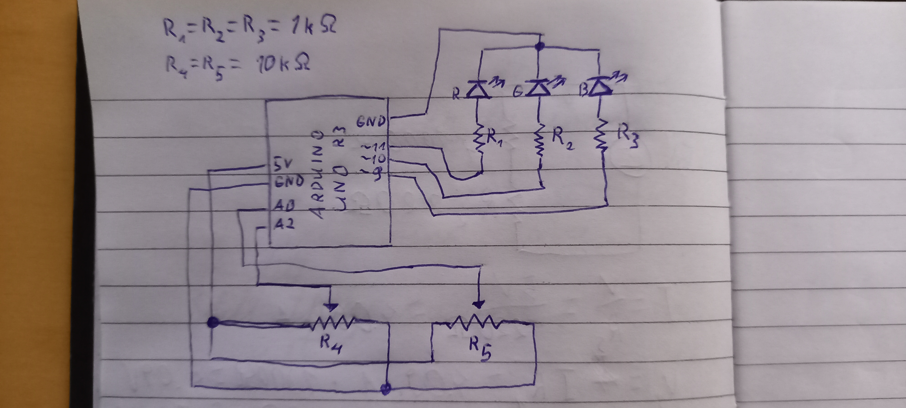

## RGB LED with adjustable hue and brightness

Arduino project to have a color and brightness adjustable led.

###How to use:
1. Clone project.
2. Build hardware based on included schematic.
 - Schematic can be found in schematic.jpg
 - Resistor values can be changed, just be sure not to cook your components.
3. Build and upload to your arduino.

##Schematic:
